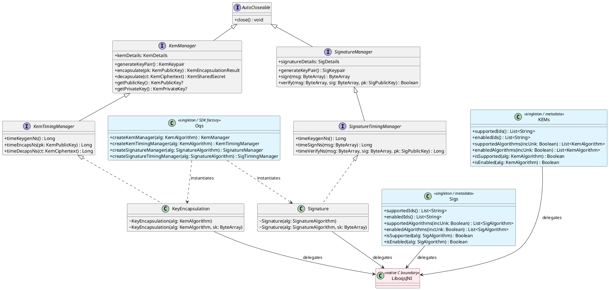

# PqcDemoApp -- Post-Quantum Cryptography Demo for Android

A multi-module Android application for benchmarking post-quantum cryptographic
algorithms on mobile devices. The project compares two independent PQC backends
-- **liboqs** (C via JNI) and **Bouncy Castle** (pure Java) -- through a unified
Kotlin API.

## Project structure

```
PqcDemoApp/
├── app/                     # Demo application (MVVM + Clean Architecture)
│   └── docs/README.md       # App-level documentation
├── libqos-android/          # Android library wrapping liboqs via JNI
│   └── docs/README.md       # Library-level documentation
├── docs/                    # This directory (project-level docs)
│   └── README.md
├── build.gradle.kts         # Root Gradle build
└── settings.gradle.kts
```

## Module documentation

| Module | Description | Docs |
|---|---|---|
| **[libqos-android](../libqos-android/docs/README.md)** | Kotlin/Java bindings for the Open Quantum Safe (liboqs) C library. Exposes KEM and signature APIs with native timing support. | [libqos-android/docs/README.md](../libqos-android/docs/README.md) |
| **[app](../app/docs/README.md)** | Jetpack Compose demo app that benchmarks PQC algorithms using both liboqs and Bouncy Castle backends. | [app/docs/README.md](../app/docs/README.md) |

## liboqs-android class diagram

The following PlantUML diagram shows the public API surface of the
`libqos-android` module:



## Supported PQC algorithm families

### KEM (Key Encapsulation Mechanisms)

| Family | liboqs | Bouncy Castle |
|---|:---:|:---:|
| ML-KEM (CRYSTALS-Kyber) | 768, 1024 | 768, 1024 |
| HQC | 192, 256 | 192, 256 |
| FrodoKEM | AES/SHAKE 976, 1344 | AES/SHAKE 976, 1344 |
| Classic McEliece | 460896(f), 6688128(f), 6960119(f), 8192128(f) | -- |

### Digital signatures

| Family | liboqs | Bouncy Castle |
|---|:---:|:---:|
| ML-DSA (CRYSTALS-Dilithium) | 65, 87 | 65, 87 |
| SLH-DSA (SPHINCS+) | SHA2/SHAKE 192/256 fast/small | SHA2/SHAKE 192/256 fast/small |
| Falcon | 1024, padded-1024 | 1024 |
| MAYO | 3 | 3, 5 |
| CROSS | RSDP/RSDPG variants | -- |
| UOV / OV | III, V, pkc, pkc-skc | -- |
| SNOVA | -- | multiple variants |

## Quick start

```bash
# Clone and open in Android Studio
git clone <repo-url>
cd PqcDemoApp

# Build the project (requires NDK 28.0.13004108)
./gradlew assembleDebug

# Install on connected device
./gradlew installDebug
```

## Requirements

- Android Studio Hedgehog or newer
- Android NDK 28.0.13004108
- Min SDK 26 (Android 8.0)
- Target device: `arm64-v8a` or `x86_64`
