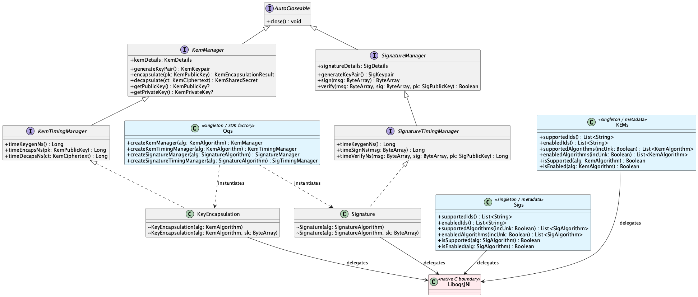

# liboqs-android

Android library providing Kotlin/Java bindings for the
[Open Quantum Safe (liboqs)](https://github.com/open-quantum-safe/liboqs) C library.
It is a substantial rewrite of the official
[liboqs-java](https://github.com/open-quantum-safe/liboqs-java) wrapper, adapted
for production mobile use with deterministic resource management, typed APIs,
native timing instrumentation, and Android-native packaging as an AAR module.

The library exposes post-quantum **Key Encapsulation Mechanisms (KEMs)** and
**Digital Signature** algorithms through a type-safe, idiomatic Kotlin API.
Any Android project can integrate post-quantum operations by adding a single
Gradle dependency.

## Architecture

The library follows a layered design:

| Layer | Description |
|---|---|
| **Public API** (`api/`) | Interfaces (`KemManager`, `SignatureManager`, …), sealed algorithm types, and data models |
| **Implementation** (`kem/`, `sig/`) | `KeyEncapsulation` and `Signature` classes that implement the API via JNI |
| **JNI boundary** | Private `native` methods that delegate to the liboqs C library |
| **Native code** (`jni/`) | C source compiled via NDK (`Android.mk`) |

### Class diagram

<p align="center">
  
</p>

<details>
<summary>Regenerating the diagram</summary>

The PlantUML source is stored in [`class-diagram.puml`](class-diagram.puml).
After editing it, regenerate the images with:

```bash
java -jar plantuml.jar -tpng docs/class-diagram.puml
java -jar plantuml.jar -tsvg docs/class-diagram.puml
```

</details>

## Package structure

```
com.example.libqos_android
├── Oqs                          # SDK entry point (singleton factory)
├── api/
│   ├── model/
│   │   ├── KemAlgorithm         # Sealed interface for KEM algorithms
│   │   ├── SignatureAlgorithm   # Sealed interface for signature algorithms
│   │   ├── PqcAlgorithm         # Registry of concrete algorithm data objects
│   │   └── PqcConstants         # liboqs algorithm ID strings
│   ├── kem/
│   │   ├── KemManager           # Core KEM operations interface
│   │   ├── KemTimingManager     # KEM + native timing interface
│   │   └── model/               # KemDetails, KemKeypair, KemEncapsulationResult, ...
│   ├── sig/
│   │   ├── SignatureManager     # Core signature operations interface
│   │   ├── SignatureTimingManager # Signature + native timing interface
│   │   └── model/               # SigDetails, SigKeypair, SigPublicKey, ...
│   └── exceptions/
│       ├── MechanismNotEnabledError
│       └── MechanismNotSupportedError
├── kem/
│   ├── KEMs                     # Metadata singleton (supported/enabled KEMs)
│   └── KeyEncapsulation         # JNI implementation of KemManager
├── sig/
│   ├── Sigs                     # Metadata singleton (supported/enabled sigs)
│   └── Signature                # JNI implementation of SignatureManager
└── utils/
    ├── Rand                     # Cryptographic RNG (JNI)
    └── CommonUtils              # Key wiping, native lib loading
```

## Supported algorithms

### KEM algorithms

| Family | Variants | NIST Level |
|---|---|---|
| **ML-KEM** (CRYSTALS-Kyber) | ML-KEM-768, ML-KEM-1024 | 3, 5 |
| **HQC** | HQC-192, HQC-256 | 3, 5 |
| **FrodoKEM** | FrodoKEM-976-AES, FrodoKEM-1344-AES, FrodoKEM-976-SHAKE, FrodoKEM-1344-SHAKE | 3, 5 |
| **Classic McEliece** | 460896, 460896f, 6688128, 6688128f, 6960119, 6960119f, 8192128, 8192128f | 3, 5 |

### Signature algorithms

| Family | Variants | NIST Level |
|---|---|---|
| **ML-DSA** (CRYSTALS-Dilithium) | ML-DSA-65, ML-DSA-87 | 3, 5 |
| **SLH-DSA** (SPHINCS+) SHA2 | 192F, 256F, 192S, 256S | 3, 5 |
| **SLH-DSA** (SPHINCS+) SHAKE | 192F, 256F, 192S, 256S | 3, 5 |
| **MAYO** | MAYO-3 | 3 |
| **Falcon** | Falcon-1024, Falcon-padded-1024 | 5 |
| **CROSS** (RSDP) | 192-fast, 256-fast, 192-balanced | 3, 5 |
| **CROSS** (RSDPG) | 192-fast, 256-fast, 192-balanced, 256-balanced | 3, 5 |
| **UOV / OV** | OV-III, OV-V, OV-III-pkc, OV-V-pkc, OV-III-pkc-skc, OV-V-pkc-skc | 3, 5 |

## Quick start

### KEM (Key Encapsulation)

```kotlin
val algorithm = PqcAlgorithm.Kem.MlKem3   // ML-KEM-768

// Receiver generates a key pair
Oqs.createKemManager(algorithm).use { receiver ->
    val keypair = receiver.generateKeyPair()

    // Sender encapsulates a shared secret with the receiver's public key
    Oqs.createKemManager(algorithm).use { sender ->
        val encaps = sender.encapsulate(keypair.public)

        // Receiver decapsulates to obtain the same shared secret
        val sharedSecret = receiver.decapsulate(encaps.kemCiphertext)

        // encaps.kemSharedSecret.bytes == sharedSecret.bytes
    }
}
```

### Digital signatures

```kotlin
val algorithm = PqcAlgorithm.Sig.MlDsa3  // ML-DSA-65

Oqs.createSignatureManager(algorithm).use { signer ->
    val keypair = signer.generateKeyPair()
    val message = "Hello PQC".toByteArray()

    val signature = signer.sign(message)

    // Anyone with the public key can verify
    Oqs.createSignatureManager(algorithm).use { verifier ->
        val isValid = verifier.verify(message, signature, keypair.public)
        // isValid == true
    }
}
```

### Performance benchmarking

```kotlin
Oqs.createKemTimingManager(PqcAlgorithm.Kem.MlKem3).use { timing ->
    timing.generateKeyPair()  // prime the keys

    val keygenNs = timing.timeKeygenNs()
    val encapsNs = timing.timeEncapsNs(timing.getPublicKey()!!)
    val decapsNs = timing.timeDecapsNs(/* ciphertext from encapsulate */)

    println("Keygen: ${keygenNs / 1_000_000.0} ms")
}
```

### Querying available algorithms

```kotlin
// All KEM algorithms compiled into the native library
val allKems: List<KemAlgorithm> = KEMs.supportedAlgorithms()

// Only the enabled ones
val enabledKems: List<KemAlgorithm> = KEMs.enabledAlgorithms()

// Check a specific algorithm
val mlKemAvailable: Boolean = KEMs.isEnabled(PqcAlgorithm.Kem.MlKem3)
```

## Build configuration

| Property | Value |
|---|---|
| Namespace | `com.example.libqos_android` |
| Compile SDK | 34 (Android 14) |
| Min SDK | 26 (Android 8.0) |
| NDK version | 28.0.13004108 |
| Supported ABIs | `arm64-v8a`, `x86_64` |
| Java target | 11 |

## Security notes

- **Key wiping**: Secret keys are zeroed from memory on `close()` via `ByteArray.wipe()`.
- **IND-CCA / EUF-CMA**: Algorithm metadata exposes the claimed security properties.
- **AutoCloseable**: All managers implement `AutoCloseable`; use Kotlin's `.use { }` blocks
  to guarantee cleanup even on exceptions.
- **Error handling**: `MechanismNotSupportedError` / `MechanismNotEnabledError` are thrown
  for invalid algorithm selections at construction time.

## Further reading

- [API reference (KDoc)](api/) -- generated from the KDoc comments in source code
- [liboqs upstream documentation](https://openquantumsafe.org/liboqs/)
- [NIST PQC standardization](https://csrc.nist.gov/projects/post-quantum-cryptography)
