# Performance Analysis Results

This document provides the complete set of extended performance visualizations referenced in **Chapter 5** of the thesis: *Analysis of Transition to Post-Quantum Cryptography on Mobile Platforms*.

The evaluation characterizes the runtime cost of Key Encapsulation Mechanisms (KEMs) and Digital Signature Algorithms (DSAs) at NIST security levels 3 and 5. Measurements on Android were collected using the Jetpack Microbenchmark framework, which automatically handles JVM warmup and thermal throttling. iOS measurements were collected using XCTest. For the complete evaluation methodology, hardware specifications, and detailed discussion of these results, please refer to the main thesis document.

---

## 1. Absolute Performance Heatmaps (Android)

The following heatmaps visualize the absolute median execution times of the evaluated post-quantum primitives on Android. The color gradient utilizes a logarithmic scale: darker green indicates faster execution times (microseconds), while darker red indicates slower execution times (milliseconds).

### Key Encapsulation Mechanisms (KEMs)

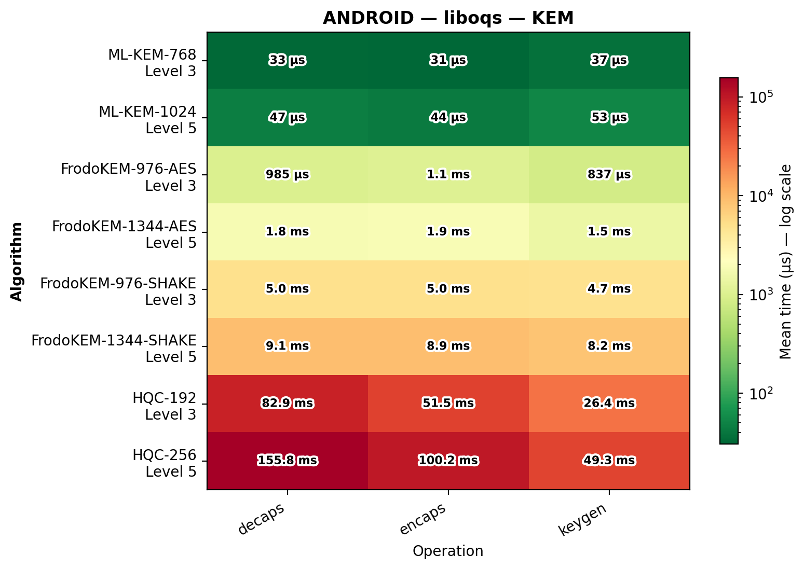
*Figure S1: Absolute median execution times of KEM operations on Android utilizing the native `liboqs` C library.*

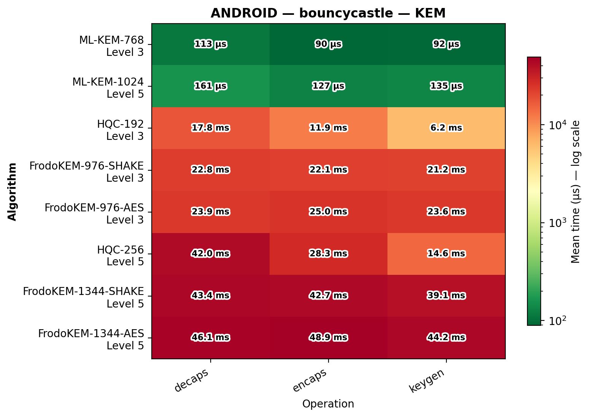
*Figure S2: Absolute median execution times of KEM operations on Android utilizing the pure-Java `Bouncy Castle` library.*

### Digital Signature Algorithms (DSAs)

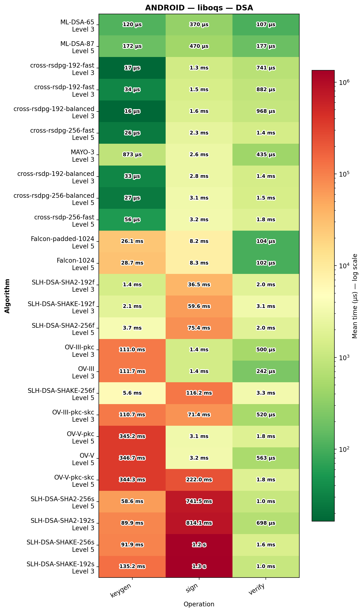
*Figure S3: Absolute median execution times of DSA operations on Android utilizing the native `liboqs` C library.*

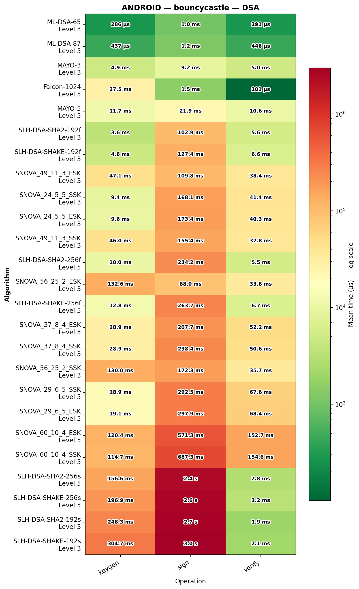
*Figure S4: Absolute median execution times of DSA operations on Android utilizing the pure-Java `Bouncy Castle` library.*

---

## 2. Relative Performance to NIST Baselines (Android)

To better contextualize the overhead introduced by alternative and fallback algorithms, the following charts normalize execution times against the finalized NIST Category 3 standards (ML-KEM-768 for key encapsulation and ML-DSA-65 for digital signatures) within the same library.

The x-axis utilizes a logarithmic scale. The multiplier inside each bar indicates how many times slower the operation is compared to the baseline standard.

### Key Encapsulation Mechanisms (KEMs)

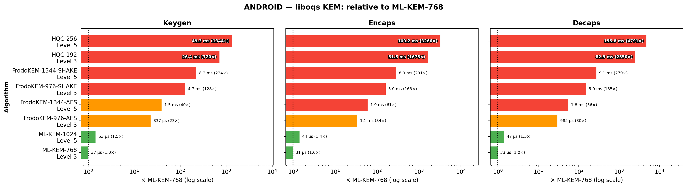
*Figure S5: Execution time of KEM operations normalized to ML-KEM-768 utilizing `liboqs`.*

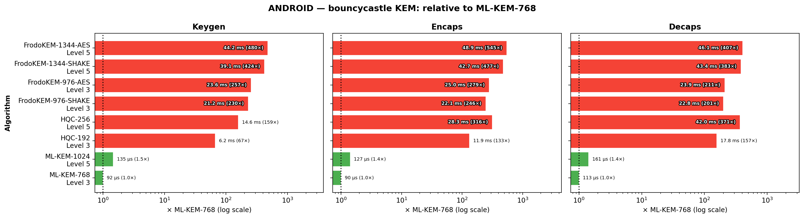
*Figure S6: Execution time of KEM operations normalized to ML-KEM-768 utilizing `Bouncy Castle`.*

### Digital Signature Algorithms (DSAs)

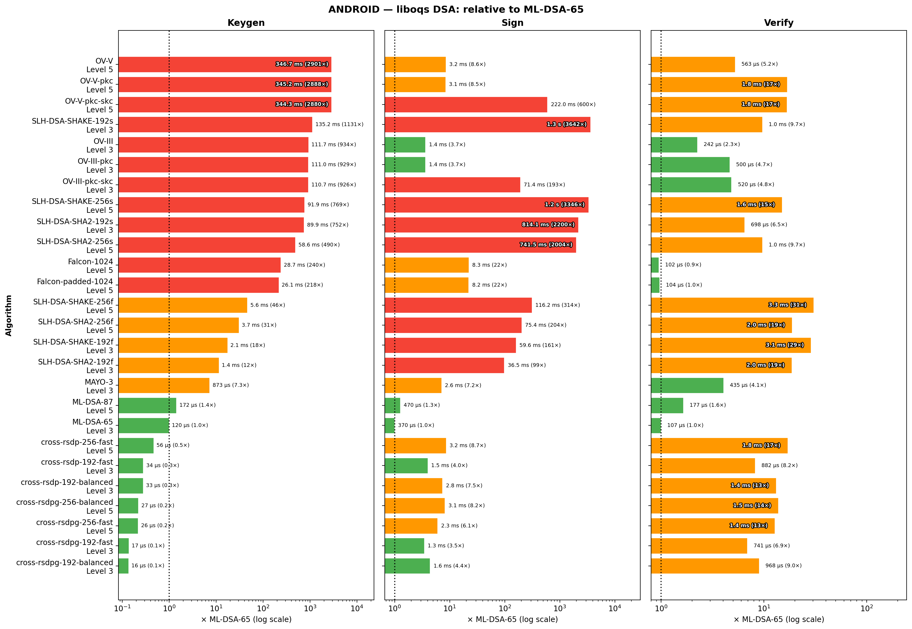
*Figure S7: Execution time of DSA operations normalized to ML-DSA-65 utilizing `liboqs`. CROSS and MAYO remain highly competitive, while UOV and hash-based schemes introduce severe latency penalties.*

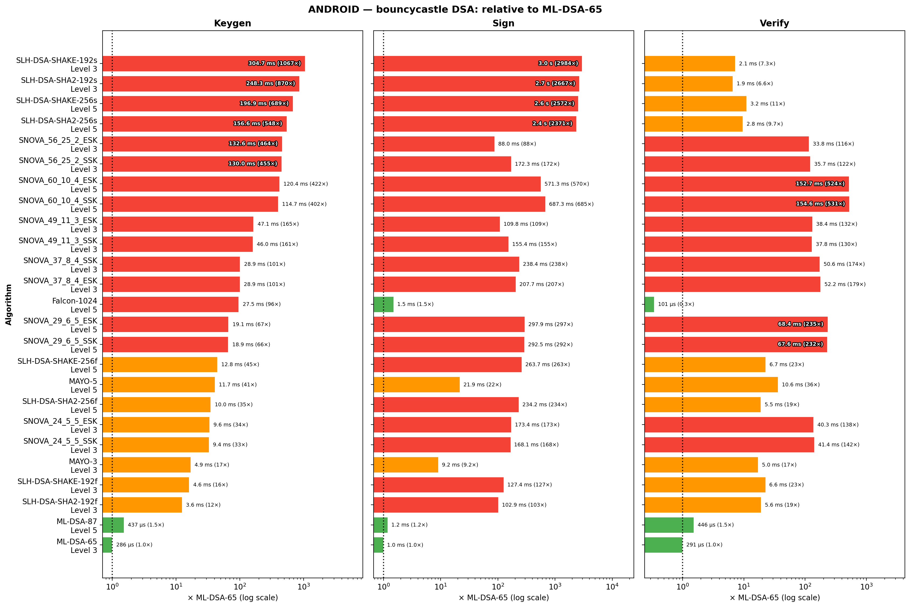
*Figure S8: Execution time of DSA operations normalized to ML-DSA-65 utilizing `Bouncy Castle`.*

---

## 3. Comparative Speedup Analysis (Android)

To evaluate the relative efficiency of the underlying software implementations, the following bar charts illustrate the performance speedup of the native `liboqs` library compared to `Bouncy Castle`.

The metric displayed is the speedup ratio ($time_{BC} / time_{liboqs}$).
* A ratio **> 1** indicates that `liboqs` is faster.
* A ratio **< 1** indicates that `Bouncy Castle` is faster.
* The red dashed line represents equal performance (1.0x).

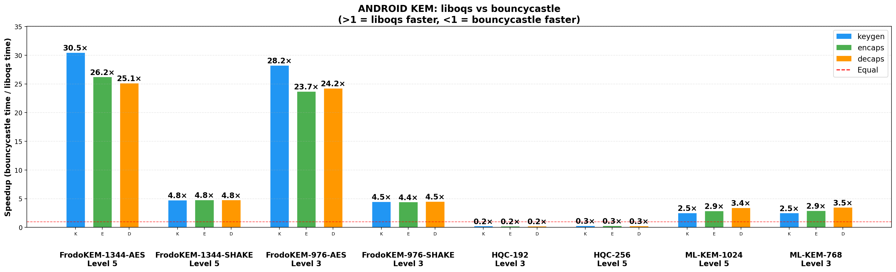
*Figure S9: Relative speedup of KEM operations at security level 3 on Android. Note the prominent performance advantage of `liboqs` for FrodoKEM-AES due to hardware-accelerated symmetric primitives, and Bouncy Castle's faster execution for HQC.*

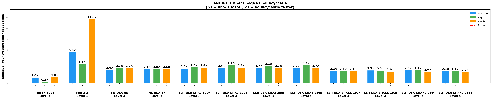
*Figure S10: Relative speedup of DSA operations at security level 5 on Android. While `liboqs` generally outperforms the Java baseline, Bouncy Castle signs notably faster for Falcon-1024, likely due to a lack of strict constant-time protections.*

---

## 4. iOS Performance Evaluation

The iOS platform was evaluated using the ML-KEM and ML-DSA algorithms supported natively by Apple's `CryptoKit` framework (iOS 26.0+). The charts below compare the raw C performance of `liboqs` against the hardware-backed `CryptoKit` implementation.

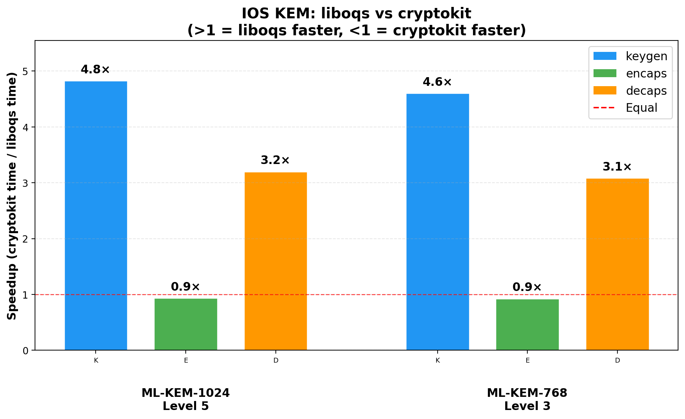
*Figure S11: Relative speedup of KEM operations on iOS (`liboqs` vs `CryptoKit`).*

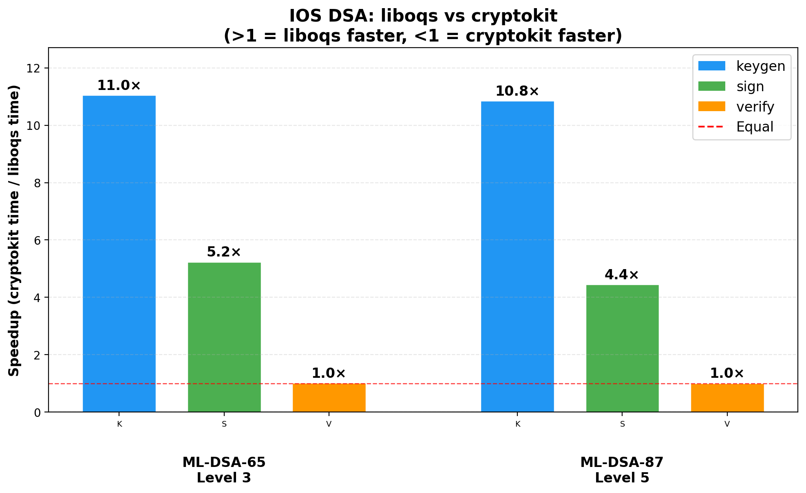
*Figure S12: Relative speedup of DSA operations on iOS (`liboqs` vs `CryptoKit`).*